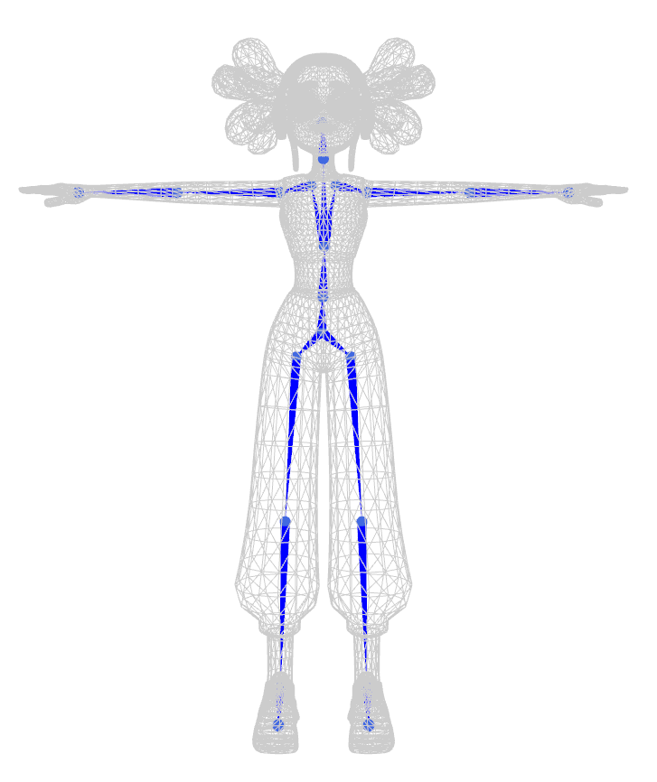

# TARig: Adaptive template-aware neural rigging for humanoid characters

```bash
sh run.sh
```


Please email to us if you need the annotated dataset of TARig.

## Recommended workflow
1. Get a 3D character from 3DGen such as [CLAY](https://github.com/CLAY-3D/OpenCLAY) or 3D Asset Website such as [Mixamo](https://www.mixamo.com/)

2. Convert the character to be .obj file
3. sh run.sh
4. The skinning weights might not meet the industry standard, so we recommend you use Maya's GVB (Geodesic Voxel Binding) function.

## Reference
```bibtex
@article{2023TARig,
  title={TARig: Adaptive template-aware neural rigging for humanoid characters},
  author={ Ma, Jing  and  Zhang, Dongliang },
  journal={Computers & graphics},
  volume={114},
  number={Aug.},
  pages={158-167},
  year={2023},
}
```


TARig is implemented based on https://github.com/zhan-xu/RigNet, thanks to Xu and the wonderful work of RigNet.
```
@article{2020RigNet,
  title={RigNet: Neural Rigging for Articulated Characters},
  author={ Xu, Zhan  and  Zhou, Yang  and  Kalogerakis, Evangelos  and  Landreth, Chris  and  Singh, Karan },
  journal={ACM Transactions on Graphics},
  year={2020},
}
```

# TODO
1. Blender Plugin
2. More accurate skeleton generation on fingers and axuilary parts.


# License
This project is under LICENSE-GPLv3.